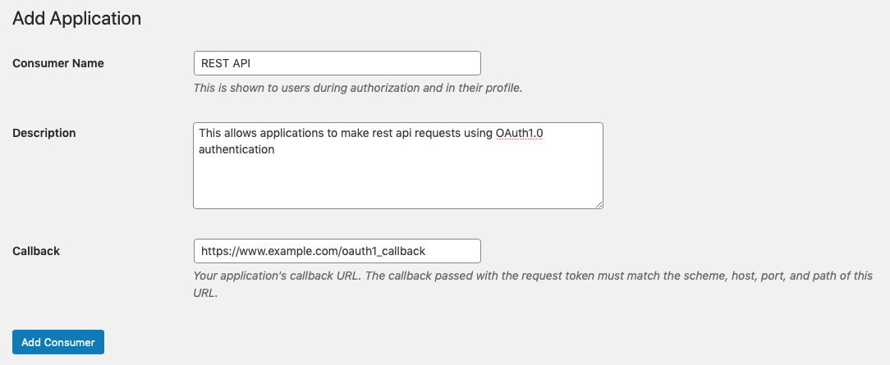
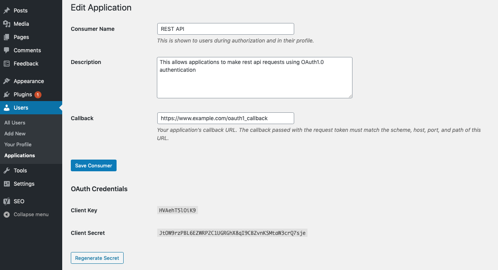
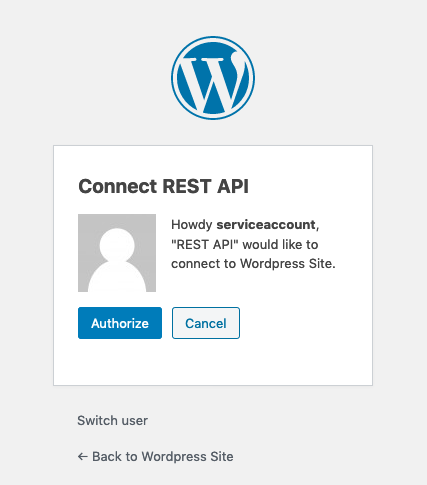
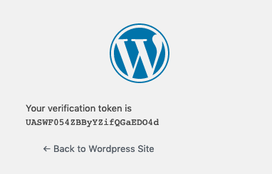
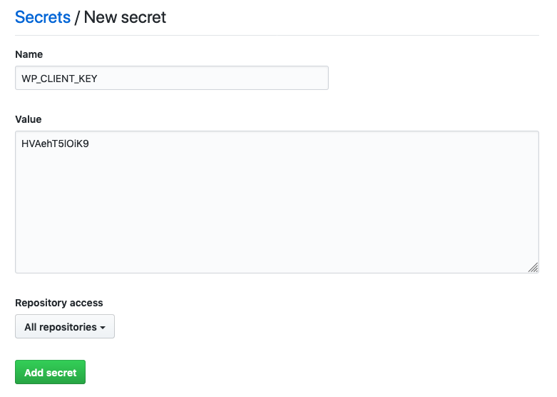
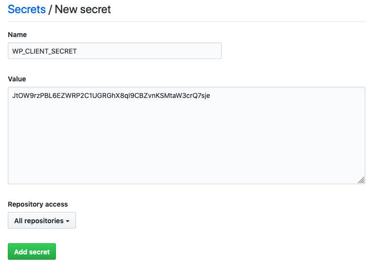
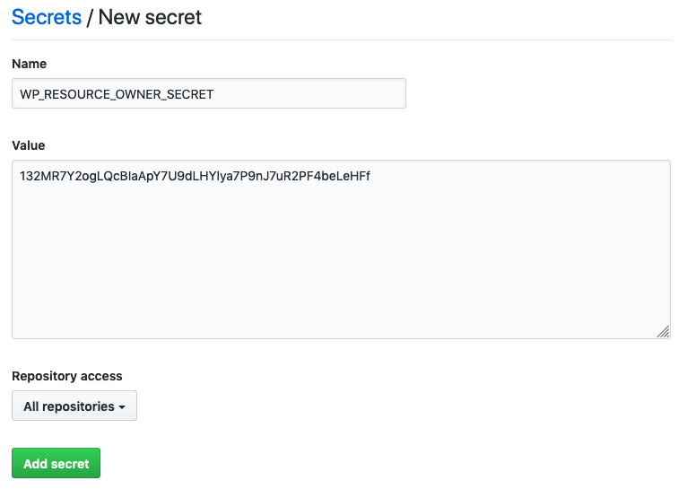
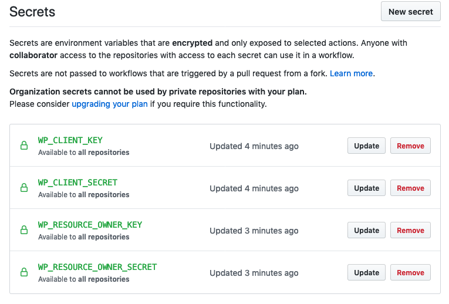

# How to use a Continuous Integration and Deployment (CI/CD) pipeline in your blogging workflow with gwbridge

A couple of years ago, I started this blog. Normally when I'm writing notes for myself, I write everything in markdown and version control it using git. This is enormously useful for making changes, and I don't need to maintain multiple versions of the same file on my hard drive. I wanted to use this same process when blogging, but alas, this meant maintaining two copies of the same content; one on the Wordpress server and one on GitHub. This was difficult to manage, and inevitably led to differences between my two versions, primarily because it's not trivial to work out what changes I had made on Wordpress after the fact.

The solution to this problem is to stop editing two distinct copies, and use the version on GitHub as the authoritative content. Using GitHub Actions, changes made to the content on GitHub can then be propagated to the Wordpress site, maintaining consistency between the two. To help achieve this, I wrote a program called [`gwbridge` (GitHub-Wordpress Bridge)](https://github.com/samuel-emrys/gwbridge). This program handles all of the logic involved with converting the markdown content to a format digestible by Wordpress.

Aside from what I've already mentioned, there are a number of reasons why you might want to do this:

1. You want your readers to be able to suggest issues with your content in a manageable way (via GitHub issues)
2. You want your readers to be able to write their own additions to allow them to contribute to the blog content, open sourcing your blog to some degree (via Pull Requests)
3. Your blog content is dynamic, and needs to be updated with some frequency. This will allow you to make changes easily, in a traceable way, without completely discarding the old content. It will always be available for users on GitHub where they can access your previous commits. You can even tag commits with helpful labels to allow your blog's history to be easier to navigate

You might _not_ want to introduce a CI/CD pipeline if:

1. You have predominantly static content. You don't update your posts, and prefer to publish a new one. Fair enough. I certainly think there's still value in a simplified editing workflow. I'm able to write my content in a plain text file, and commit it to GitHub to put it under version control and publish it. This negates any need for me to use Wordpress's clunky editor.

In this guide, I'm going to cover the following:

1. Configuring your Wordpress site to allow it to be automatically updated
2. Linking your GitHub repository to a Wordpress post
3. Configuring GitHub Actions to run `gwbridge` every time you commit to the `master` branch on your GitHub repository

## Configuring your Wordpress site

Okay, so the first step is to configure your Wordpress site. This mostly just involves setting it up to allow programmatic authentication to the server. To do this, first set up a user to authenticate as. For my site, I use a service account to do this (named `service_account`); that is, an account which is solely designed to be used by applications instead of people. This isn't a strict requirement; you could just as validly use your own user account, but the important part here is that this user account has at least "Editor" role to allow it to create and publish posts. Next, you need to install the [Wordpress REST API - OAuth 1.0a Server](https://wordpress.org/plugins/rest-api-oauth1/) plugin, which will give you a secure way of authenticating to the blog remotely. It achieves this by not disclosing any user passwords directly, and instead provides authentication tokens to use.

Now that you have the plugin installed, navigate to Users > Applications, select "Add New", and populate it as follows:



When complete, select "Add Consumer", which should lead to a page that looks like the following:



You'll note that it has now provided you with Client Key and Client Secret values; take note of these, as we'll need them in the next step.


## Setting up your GitHub repository

There are three ways of setting GitHub up for your blog posts:

1. One repository containing _all_ of your blog posts as discrete files
2. One repository for each blog post you have in your personal profile
3. One repository for each blog post you have in an organisation

There are advantages and disadvantages for each, so take some time to work out which one works best for you. I didn't design `gwbridge` with (1) in mind though, so for the purposes of this post, I'll only be addressing (2) and (3). It is still possible to achieve with (1), however you would need to add a new GitHub Action for each post individually.

### Installing gwbridge

To begin, install `gwbridge` locally using one of the following commands:

```bash
$ pip install git+https://github.com/samuel-emrys/gwbridge.git
$ pipx install git+https://github.com/samuel-emrys/gwbridge.git
```

Note that using `pipx` is the recommended method of installation since it isolates each package and still makes it available in the global context, meaning that there's not danger of conflicting dependencies between this python project and any others you may have installed already. See the [`pipx` installation isntructions](https://github.com/pipxproject/pipx#install-pipx) to install it.

### Initialising the repository

Now that `gwbridge` is installed, navigate to your project repository and initialise it as follows:

```bash
user@ubuntu:/path/to/your/blog/post $ gwbridge init
Enter the base URL of the wordpress blog to update (required): https://www.example.com/wp-json
Enter the version of the API you wish to use [wp/v2]:
Enter the name of the file to publish [README.md]:
Configuration file created at .deploy/config.json
Metadata file created at .deploy/metadata.json
```

Follow the prompts to fill in the information relevant to your site. The base url of your site will often be the address with `wp-json` on the end; this is the base url of your site's REST endpoint. You probably won't need to change the API version of your website, excepting of course future releases of Wordpress or if you're running an older version of Wordpress. Finally, the name of the file to publish. The default for this is `README.md`, and this is what I name my content files, purely because files named `README.md` are automatically rendered on a GitHub repository, whereas other file names are not. If you want to name your content file something else, change the name here. This creates a folder named `.deploy` in your repository, containing two files: `config.json`, and `metadata.json`. `config.json` contains the information you just entered here, and you can change it at any time if you enter anything incorrectly. `metadata.json` contains the post metadata. This includes fields such as `id`, `slug`, `author`, and `status`, among others. The full list of available metadata fields is available in the [Wordpress REST documentation](https://developer.wordpress.org/rest-api/reference/posts/). Note that the fields `title` and `content` should NOT be included in this file - The `title` field will be automatically populated based on the top level heading in your specified file, and `content` will be populated from the rest of the file.

The default value for the `status` field will be "draft", and so this will only be published as a draft. To publish a post, you should change this to "publish". The `author` default value is 1, corresponding to the user with user id of 1. The `id` field is the id of the post to which this is linked. If you're adding this to an existing post, you'll need to add the post id here before committing any changes.

### Create service credentials

Next, you'll need to authenticate using the OAuth1.0 server we set up earlier. This will generate some unique credentials to allow gwbridge to publish and edit posts. This can be achieved as follows, using the Client Key and Client Secret that we generated earlier.

```bash
user@ubuntu:/path/to/your/blog/post $ gwbridge authenticate --client-key HVAehT5lOiK9 --client-secret JtOW9rzPBL6EZWRP2C1UGRGhX8qI9CBZvnKSMtaW3crQ7sje
Authenticate at the following URL to obtain a verification token: https://www.example.com/oauth1/authorize?oauth_token=VPiw6DaQ2c3ivHmPD0iPaZJU
Enter the verification token: UASWF054ZBByYZifQGaEDO4d
Client key               HVAehT5lOiK9
Client secret            JtOW9rzPBL6EZWRP2C1UGRGhX8qI9CBZvnKSMtaW3crQ7sje
Resource owner key       tnrvBoP733yDSe11lBLAa8Em
Resource owner secret    132MR7Y2ogLQcBIaApY7U9dLHYlya7P9nJ7uR2PF4beLeHFf
```

Navigate to the URL that's been generated for you, and authenticate using the username and password for the account you created earlier (for me this was `service_account`). You should then be presented with a page similar to the following:



Select "Authorize", and you should be directed to a page similar to the following:



Copy and paste this verification token, and enter it in the command line prompt. This will then generate the Resource owner key and Resource owner secret as demonstrated above. These credentials will not expire, so this process is one you will only need to repeat once, and can be used for all the repositories you set up this way. These will be the values which you can use to authorize `gwbridge` in the following steps. Note that the values provided here are not valid values, so don't get any ideas about using them on my site ;)


## Configuring GitHub Actions

### Adding secrets

To make sure that your authentication tokens are secure, we need to add them to your GitHub repository as secrets. This will prevent them from being displayed in any console output, such as when they're used as input arguments to a program, which is how they will be used in this case. If you've set up an organisation, then you'll only need to create one set of secrets, however if you are initialising each repository independently in your own personal profile, then you'll need to configure these secrets for each repository you use. Navigate to Settings > Secrets, and select "New Secret" for each of the following items:








Once you've added these, you should end up with a list that looks similar to the following:



Excellent, now we can go about automating the publish process every time there is a commit to the `master` branch of the repository.

### Creating a GitHub Action

There is a guided tour on how to create an action available in the "Actions" tab of your GitHub repository, however since we know exactly what our action will consist of, we can just create a YAML file manually. Create a new file in your repository, `.github/workflows/publish.yml`, and populate it with the following:

```yaml
name: Publish Blog Post

on:
  push:
    branches: 
      - master

jobs:
  deploy:

    runs-on: ubuntu-latest

    steps:
    - uses: actions/checkout@v2
    - name: Set up Python
      uses: actions/setup-python@v2
      with:
        python-version: '3.7'
    - name: Install dependencies
      run: |
        wget https://github.com/jgm/pandoc/releases/download/2.9.2.1/pandoc-2.9.2.1-1-amd64.deb -O /tmp/pandoc.deb
        sudo dpkg -i /tmp/pandoc.deb
        python -m pip install --upgrade pip
        pip install git+https://github.com/samuel-emrys/gwbridge.git
    - name: Publish
      run: |
        gwbridge publish --client-key ${{ secrets.WP_CLIENT_KEY }} --client-secret ${{ secrets.WP_CLIENT_SECRET }} --resource-owner-key ${{ secrets.WP_RESOURCE_OWNER_KEY }} --resource-owner-secret ${{ secrets.WP_RESOURCE_OWNER_SECRET }}
    - name: Update metadata
      run: |
        if ! git diff-index --quiet HEAD --; then
          git config --global user.name 'Samuel Dowling'
          git config --global user.email 'samuel-emrys@users.noreply.github.com'
          git commit -am "Automated metadata update"
          git push
        fi
```

Make sure you change the `user.name` and `user.email` parameters to values relevant to you, and save and exit. Commit all of these files to your repository, and you should have a structure similar to the following:

```bash
/path/to/your/blog/post
├── .deploy
│   ├── config.json
│   └── metadata.json
├── .github
│   └── workflows
│       └── publish.yml
├── .gitignore
├── README.md
└── img
    ├── image1.png
    └── image2.png
```

Now you can commit everything to your repository:

```bash
user@ubuntu:/path/to/your/blog/post $ git commit -am "Configured CI/CD pipeline for repository"
user@ubuntu:/path/to/your/blog/post $ git push origin master
```

And now you should see the action run, and your Wordpress blog automatically updated with the content you push to this repository in the future. It's important to note that after pulling, you _may_ need to pull again. This is because, if it's creating a new post or updating the metadata, these changes will be propagated back to your repository so that new posts aren't created in the future, and the current one is updated. This will also allow you to change the metadata from your repository directly, which is a cool side effect.

Anyway, I hope this has helped you improve your blogging workflow; if you have any questions or comments feel free to leave a comment below, and if you've noticed any issues with the article, or would like to improve it, feel free to submit an [issue](https://github.com/samuel-emrys-blogs/blogging-with-cicd/issues) or [pull request](https://github.com/samuel-emrys-blogs/blogging-with-cicd/issues)!

[This post is also available on GitHub](https://github.com/samuel-emrys-blogs/blogging-with-cicd)
